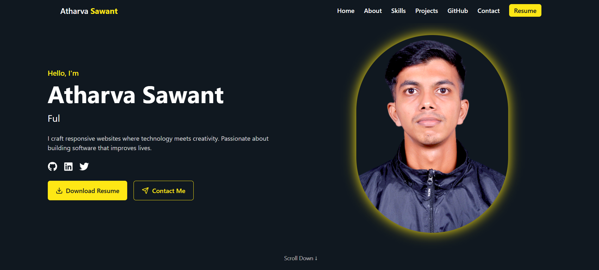

# Atharva Sawant Portfolio

A responsive and interactive personal portfolio website built with React, Vite, and Tailwind CSS. It showcases professional experience, education, skills, projects, GitHub stats, and contact details.

## Table of Contents

- [Demo](#demo)
- [Features](#features)
- [Navigation](#navigation)
- [Project Data](#project-data)
- [Skills](#skills)
- [Tech Stack](#tech-stack)
- [Getting Started](#getting-started)
- [File Structure](#file-structure)
- [Customization](#customization)
- [Deploy](#deploy)
- [License](#license)

## Demo



## Features

- Fully responsive layout for desktop and mobile
- Fixed top navbar with smooth section scrolling
- Conditional `Live Demo` project button rendering when demo URL exists
- Resume button opens in a new tab and triggers file download
- About section groups education and experience
- Skills section includes both technical and soft skills
- Projects showing image, description, tags, GitHub link, and optional demo link
- GitHub stats section shows recent GitHub metrics
- Contact form and footer

## Navigation

Navbar items:

1. Home (#hero)
2. About (#about)
   - Education (#education)
   - Experience (#experience)
3. Skills (#skills)
4. Projects (#projects)
5. GitHub (#github)
6. Contact (#contact)
7. Resume (downloads `AtharvaSawant.pdf` as a new tab)

## Project Data

- At least 4 projects are defined in `src/components/ProjectSection.jsx`
- Each project has:
  - `title`
  - `description`
  - `image`
  - `tags`
  - `githubLink`
  - optional `demoLink`

## Project Showcase (Markdown style)

Below is a README-friendly representation of your project cards similar to the UI screenshot:

### UI Badge Style

Use badge-style tags in markdown:

``

### Example

   

## Skills

`src/components/SkillsSection.jsx` supports categories:

- Frontend
- Backend
- Database
- Tools
- Soft Skills (e.g., attention to detail, time management, communication, adaptability, problem solving, teamwork)

## Tech Stack

- React 18
- Vite
- Tailwind CSS
- lucide-react icons
- framer-motion for subtle animations
- Devicon icon fonts

## Getting Started

1. Clone repository:

```bash
git clone https://github.com/<username>/<repo>.git
cd portfolio
```

2. Install dependencies:

```bash
npm install
```

3. Run development server:

```bash
npm run dev
```

4. Preview in browser: `http://localhost:5173`

5. Build production bundle:

```bash
npm run build
```

6. Preview build:

```bash
npm run preview
```

## File Structure

- `src/main.jsx` - app entrypoint
- `src/App.jsx` - root container
- `src/components/` - reusable UI sections
  - `Navbar.jsx`
  - `HeroSection.jsx`
  - `EducationSection.jsx`
  - `ExperienceSection.jsx`
  - `SkillsSection.jsx`
  - `ProjectSection.jsx`
  - `GithubStatsSection.jsx`
  - `ContactSection.jsx`
  - `Footer.jsx`
- `src/pages/Index.jsx` - page layout
- `src/assets/` - static files (includes `AtharvaSawant.pdf`)

## Customization

- update nav links in `Navbar.jsx`
- edit skills in `SkillsSection.jsx`
- add/remove projects in `ProjectSection.jsx`
- change education/experience in respective sections
- update theme colors in `src/index.css` or `App.css`

## Deploy

- Host on Netlify / Vercel / GitHub Pages
- Copy production output from `dist/`
- Set base path if hosted under subpath

## License

MIT License

